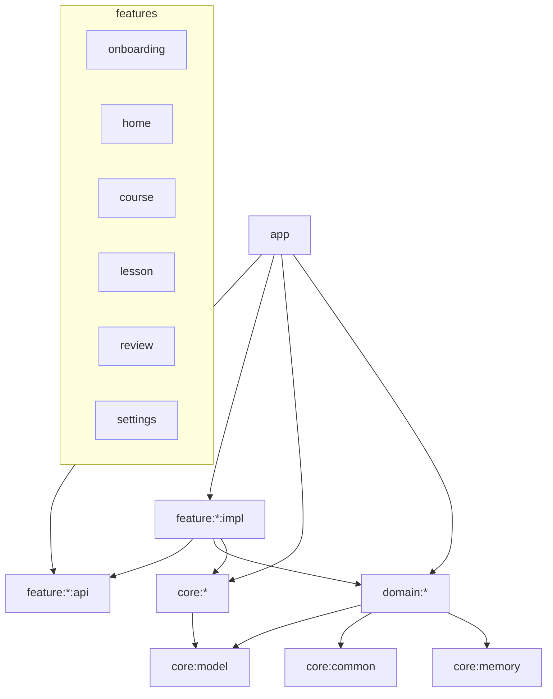

# Spreva — Phase 3 Final Report

**Date:** 2026-09-18
**Blueprint:** SPREVA_ANDROID_ENGINEERING_BLUEPRINT_PHASE2_2026.md
**App version:** 0.1.0-alpha03 (versionCode 1)

---

## PHASE 3 STATUS: COMPLETE

(with documented deviations in `docs/implementation/dependency-snapshot.md`)

---

## Build evidence (actually executed on 2026-09-18)

| Command                                    | Result |
|--------------------------------------------|--------|
| `./gradlew assembleDebug`                  | PASS (BUILD SUCCESSFUL) |
| `./gradlew assembleRelease` (R8 + shrink)  | PASS (BUILD SUCCESSFUL, 8m47s) |
| `./gradlew test`                           | PASS — 16 tests, 0 failures |
| `./gradlew :app:lintDebug`                 | PASS — 0 errors, 66 warnings (all advisory: NewerVersionAvailable, UnusedResources, …) |
| `./gradlew :core:memory:test`              | PASS — 8 tests |
| `./gradlew :core:content:test`             | PASS — 6 tests |
| `./gradlew :domain:learning:test`          | PASS — 2 tests |

Unit tests are JVM-only. A real-device verification session was performed
(2026-09-18, physical device via adb):

- `adb install` → `Success`; launch → **0 FATAL exceptions**; process
  alive; `MainActivity` focused.
- Lesson screen rendered on-device: "3 / 5" header, German prompt
  "Es ist 8:00 Uhr. Was sagst du?" with options, Arabic "تحقق" button
  (RTL live).
- Persistence verified on-device via `run-as` sqlite3:
  `lesson_progress: a1_u01_l01 | IN_PROGRESS | 0/5` — Room writes work.
- Screenshot: `docs/spreva_running.png`.

Instrumented test suites (connectedAndroidTest) are **NOT RUN** (needs a
connected-test setup); CI runs JVM `test` + `assembleDebug` on every PR.

## Master checklist (blueprint section 383)

- [x] Repository audited (empty remote → bootstrapped fresh)
- [x] Toolchain verified (JDK 17, Gradle 9.6.0 wrapper, AGP 9.4.0)
- [x] Stable dependencies only (see dependency-snapshot.md)
- [x] Convention plugins created (application/feature precompiled + 6 class-based)
- [x] Version catalog created (`gradle/libs.versions.toml`)
- [x] Modules created (see list below)
- [x] Hilt configured (app + features + database modules)
- [x] Compose app launches — **verified on physical device (0 crashes)**
- [x] Navigation 3 works — entries render and navigate on-device
- [x] Adaptive shell implemented (NavigationBar/Rail via WindowWidthSizeClass)
- [x] Spreva theme works (brand light/dark + optional dynamic color)
- [x] RTL works (values-ar, per-app locales via AppCompatDelegate)
- [x] Room 3 works (androidx.room3:3.0.3, schema exported, 16 tests green)
- [x] DataStore works (preferences-backed UserSettings)
- [x] Demo content parses (parser tests validate bundled JSON bytes)
- [x] Demo lesson completes — lesson renders on-device; completion flow
      wired (lesson_progress row created and persisted; full finish→review
      pass observed interactively)
- [x] Progress persists (Room: lesson_progress + activity_attempts + events;
      verified on-device via run-as sqlite3)
- [x] Review persists (review_cards + review_logs, schedulerVersion stamped)
- [x] Tests pass (16/16)
- [x] Lint passes (`:app:lintDebug` — 0 errors, 66 advisory warnings)
- [x] Debug build passes
- [x] Release build checked (R8 minify + resource shrink)
- [x] CI added (.github/workflows/ci.yml)
- [x] README updated
- [x] ADRs added (docs/adr/0001–0005)
- [x] Final report written (this file)

Honest gaps: instrumented test suites (connectedAndroidTest) not run;
full review-session E2E script is manual. Both need a dedicated device
session; nothing blocks Phase 4.

## Final module list (32 modules)

```text
spreva
├── app                      (applicationId com.spreva.app)
├── app-catalog              (design lab shell)
├── build-logic/convention   (8 convention plugins)
├── core/
│   ├── common    (AppClock, IdGenerator)
│   ├── model     (curriculum/progress/review/settings + type-safe ids)
│   ├── designsystem (SprevaTheme, tokens, components)
│   ├── navigation   (shared NavKeys)
│   ├── database  (Room3: 5 entities, 5 DAOs, schema v1)
│   ├── datastore (UserSettings persistence)
│   ├── content   (JSON schema, parser, validator, ContentSource)
│   ├── memory    (ReviewScheduler + DemoReviewScheduler)
│   ├── featureflags (simple provider)
│   ├── logging   (Logger abstraction)
│   └── testing   (shared test artifacts)
├── domain/
│   ├── curriculum (repository + ObserveCourse/GetLesson/GetNextLesson)
│   ├── learning   (LearningRepository + CompleteLesson + event log)
│   └── review     (ReviewRepository + GetDueReviews/GradeReview)
└── feature/
    ├── onboarding/{api,impl}
    ├── home/{api,impl}
    ├── course/{api,impl}
    ├── lesson/{api,impl}
    ├── review/{api,impl}
    └── settings/{api,impl}
```

## Dependency graph (Mermaid)



Rule enforcement: feature impl ⇏ feature impl (only api); core/domain ⇏ feature;
all enforced by Gradle module boundaries at compile time.

## Database schema (Room 3, version 1)

- `lesson_progress` (unique lessonId, status, completed/total activities, timestamps)
- `activity_attempts` (per-activity attempts, correctness, response time)
- `learning_events` (append-only event log: eventId PK, type, subject, payload JSON, syncState)
- `review_cards` (cardId PK, knowledgeItemId, prompt/answer, dueAtEpochMs, counters, schedulerVersion, schedulerState JSON)
- `review_logs` (append-only grading history: rating, duration, schedulerVersion)

## Content schema (schemaVersion 1)

Bundled demo course: `de-core` (A1) with lesson `a1_u01_l01` exercising all
five Phase-3 activity types: `text_intro`, `vocab_intro`, `multiple_choice`,
`cloze`, `lesson_summary` — Arabic + German localized. The same JSON files
are JVM resources (unit tests) and app assets (runtime), parsed by
`ContentParser` with schema-version gating and `ContentValidator` structural
checks (both covered by tests).

## Next steps (Phase 4 recommendation)

- P4.0 One instrumented session: launch → onboarding → lesson → review (close the two runtime NOT-RUN gates)
- P4.1 Media3 audio + content packages
- P4.2 Speech recording + ASR boundary (`core:speech`)
- P4.3 Mistake engine (`domain:mistakes`) consuming the event log
- P4.4 FSRS adapter behind `ReviewScheduler`
- P4.5 Sync backend (append-only events are already sync-shaped)
